# Jainsight 사용자 가이드

이 문서는 Jainsight 플랫폼의 모든 메뉴, 화면 구성 및 CRUD 사용법에 대한 포괄적인 가이드를 제공합니다. 각 섹션에는 화면의 스크린샷 위치가 표시되어 있어, 실제 사용 환경의 화면을 캡처하여 완성할 수 있습니다.

## 목차

1.  [대시보드](#1-대시보드)
2.  [SQL 에디터](#2-sql-에디터)
3.  [데이터 관리](#3-데이터-관리)
4.  [사용자 관리](#4-사용자-관리)
5.  [시스템 관리](#5-시스템-관리)
6.  [AI 관리](#6-ai-관리)
7.  [보안 관리](#7-보안-관리)
8.  [모니터링](#8-모니터링)

---

## 1. 대시보드

플랫폼의 전반적인 현황을 한눈에 파악할 수 있는 메인 화면입니다.

### 1.1 메인 오버뷰

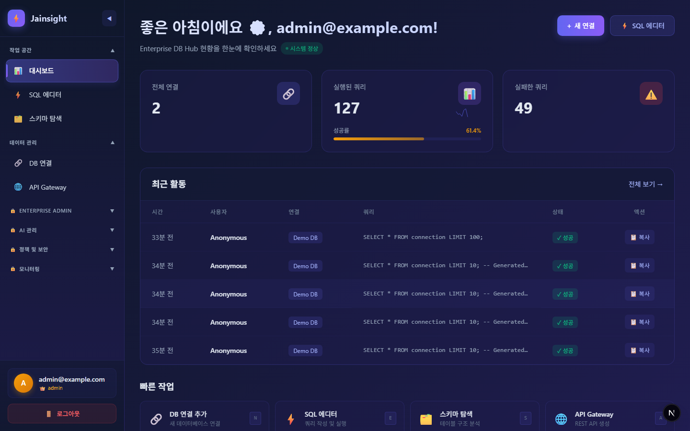
**설명:**

- **상단 통계 카드**: 총 사용자 수, 활성 연결 수, 오늘 실행된 쿼리 수 등 핵심 지표를 보여줍니다.
- **활동 그래프**: 최근 쿼리 실행 추이 및 AI 사용량을 시각적으로 표시합니다.
- **빠른 작업**: 자주 사용하는 기능(새 쿼리 작성, 연결 추가 등)으로 바로 이동하는 바로가기 버튼입니다.
- **최근 활동**: 최근에 수행된 주요 작업 로그가 실시간으로 업데이트됩니다.

---

## 2. SQL 에디터

자연어를 통해 SQL을 생성하고 실행할 수 있는 핵심 작업 공간입니다.

### 2.1 에디터 인터페이스

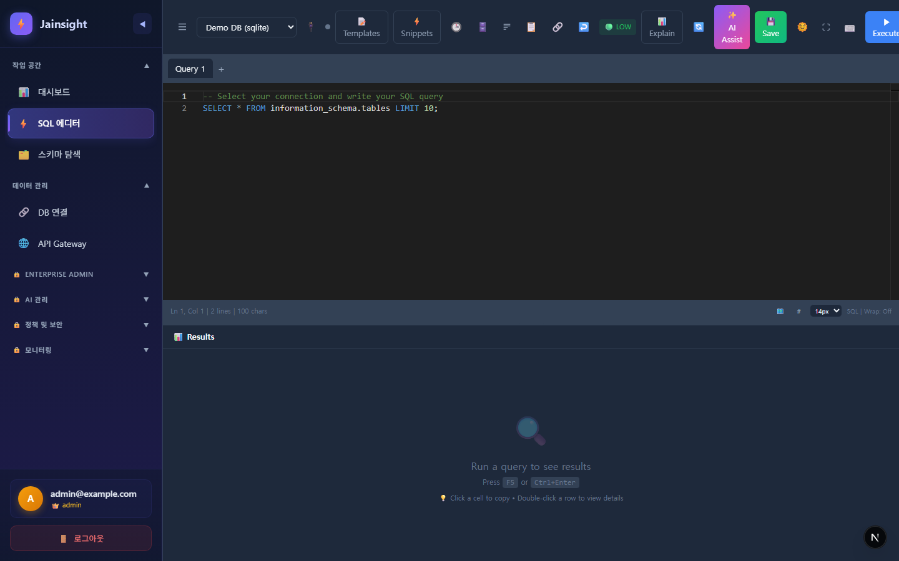
**기능:**

- **데이터베이스 선택**: 좌측 사이드바에서 사용할 데이터베이스 스키마를 선택합니다.
- **자연어 입력창**: 원하는 데이터를 자연어로 질문합니다 (예: "지난달 가입한 사용자 수 보여줘").
- **SQL 생성 결과**: AI가 생성한 SQL 쿼리가 표시되며, 이를 수정하거나 바로 실행할 수 있습니다.

### 2.2 결과 그리드 및 히스토리

**CRUD 작업:**

- **실행 (Execute)**: `Ctrl+Enter` 또는 실행 버튼을 눌러 쿼리를 실행합니다.
- **저장 (Save)**: 자주 사용하는 쿼리를 '저장된 쿼리' 목록에 추가합니다.
- **내보내기 (Export)**: 결과를 CSV/Excel/JSON 파일로 다운로드합니다.
- **히스토리 조회**: 과거 실행했던 쿼리 기록을 조회하고 재사용합니다.

---

## 3. 데이터 관리

외부 데이터베이스 연결 및 API 게이트웨이를 관리합니다.

### 3.1 연결 관리 (Connections)

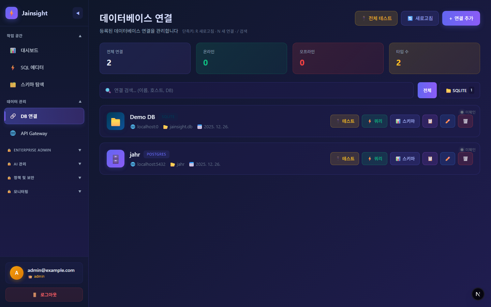
**CRUD 설명:**

- **조회 (Read)**: 등록된 모든 데이터베이스 연결 상태(성공, 실패)를 확인합니다.
- **생성 (Create)**: `+ 연결 추가` 버튼을 눌러 새 데이터베이스(PostgreSQL, MySQL, Snowflake 등) 정보를 입력합니다.
- **수정 (Update)**: 기존 연결의 호스트, 포트, 계정 정보를 수정하고 연결 테스트를 수행합니다.
- **삭제 (Delete)**: 더 이상 사용하지 않는 연결을 제거합니다.

### 3.2 API 게이트웨이

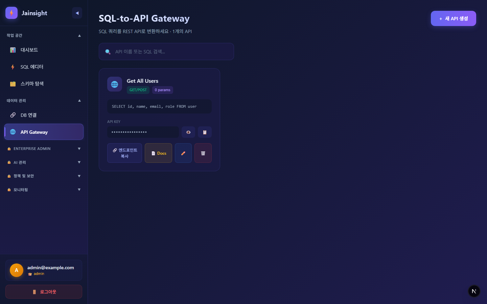
**기능:**

- **API 생성**: 저장된 SQL 쿼리를 기반으로 REST API 엔드포인트를 생성합니다.
- **테스트**: 생성된 API를 즉시 호출하여 응답을 확인합니다.
- **문서화**: Swagger UI를 통해 API 명세를 자동으로 제공합니다.

---

## 4. 사용자 관리 (엔터프라이즈)

팀원 초대, 그룹 관리 및 역할 기반 권한 제어(RBAC)를 수행합니다.

### 4.1 사용자 목록

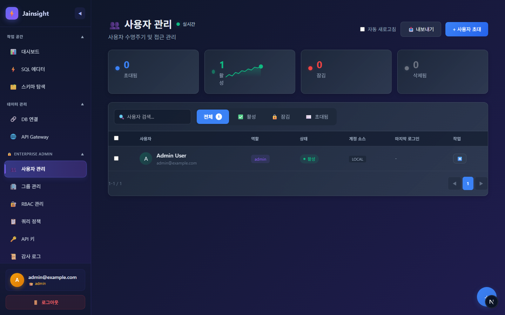
**CRUD 설명:**

- **조회 (Read)**: 모든 사용자의 이름, 이메일, 소속 그룹, 상태를 확인합니다.
- **초대 (Create)**: 이메일 발송을 통해 신규 사용자를 초대하고 기본 그룹을 할당합니다.
- **수정 (Update)**: 사용자의 그룹을 변경하거나 계정을 활성화/비활성화합니다.
- **삭제 (Delete)**: 퇴사한 시스템에서 영구적으로 제거합니다.

### 4.2 그룹 및 역할

**기능:**

- **역할 정의**: 커스텀 역할(예: "데이터 분석가")을 생성하고 세부 권한(쿼리 실행, 설정 변경 등)을 부여합니다.
- **그룹 매핑**: 부서별 그룹을 생성하고 역할을 할당하여 권한 관리를 간소화합니다.

---

## 5. 시스템 관리

전역 설정, 쿼리 정책 및 감사 로그를 관리합니다.

### 5.1 쿼리 정책

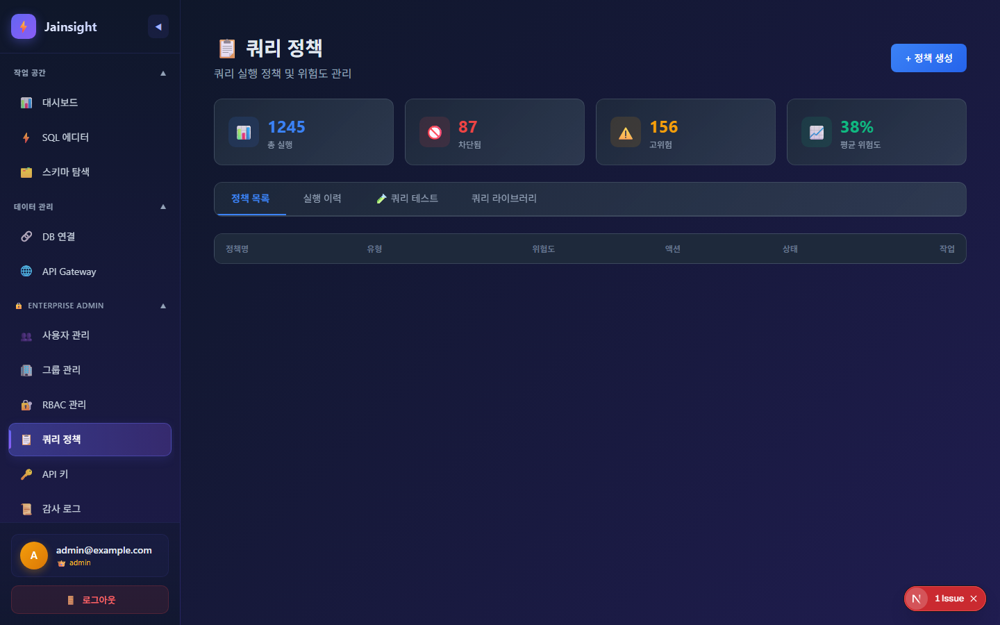
**CRUD 설명:**

- **정책 설정 (Update)**: 최대 실행 시간, 최대 반환 행 수(Row Limit) 등을 설정하여 시스템 부하를 방지합니다.

### 5.2 API 키

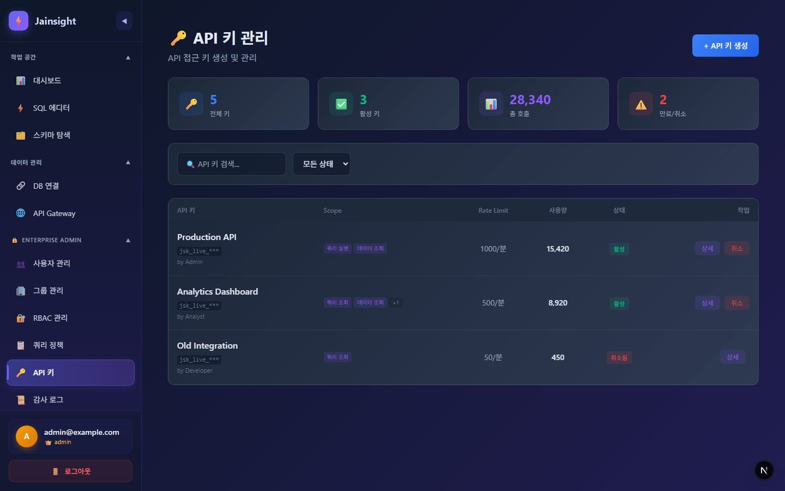
**CRUD 설명:**

- **생성 (Create)**: 외부 시스템 연동을 위한 API 키를 발급하고 스코프를 제한합니다.
- **삭제 (Delete/Revoke)**: 유출되었거나 만료된 키를 즉시 폐기합니다.

---

## 6. AI 관리

LLM 공급자, 생성 모델 및 프롬프트 템플릿을 설정합니다.

### 6.1 공급자 및 모델

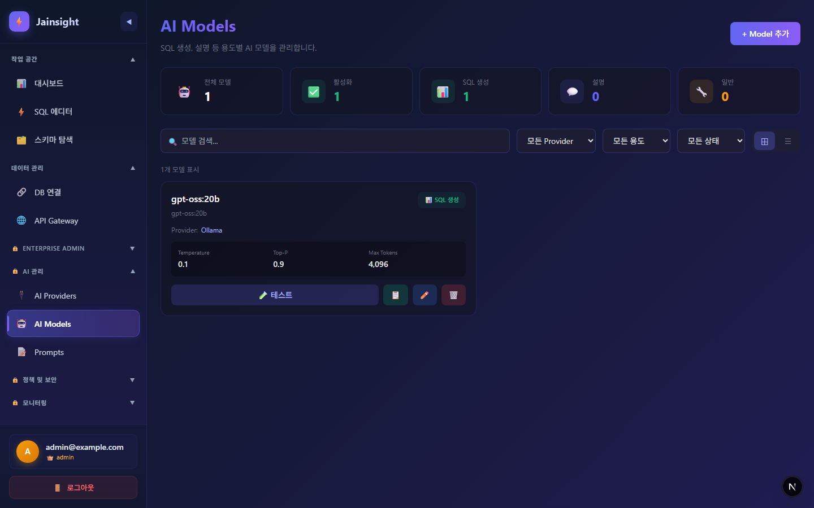
**CRUD 설명:**

- **조회 (Read)**: OpenAI, Ollama, vLLM 등 연결된 AI 서비스의 상태를 모니터링합니다.
- **설정 (Update)**: 모델별 파라미터(Temperature, Top-P)를 조정하여 SQL 생성 정확도를 최적화합니다.

### 6.2 프롬프트 관리

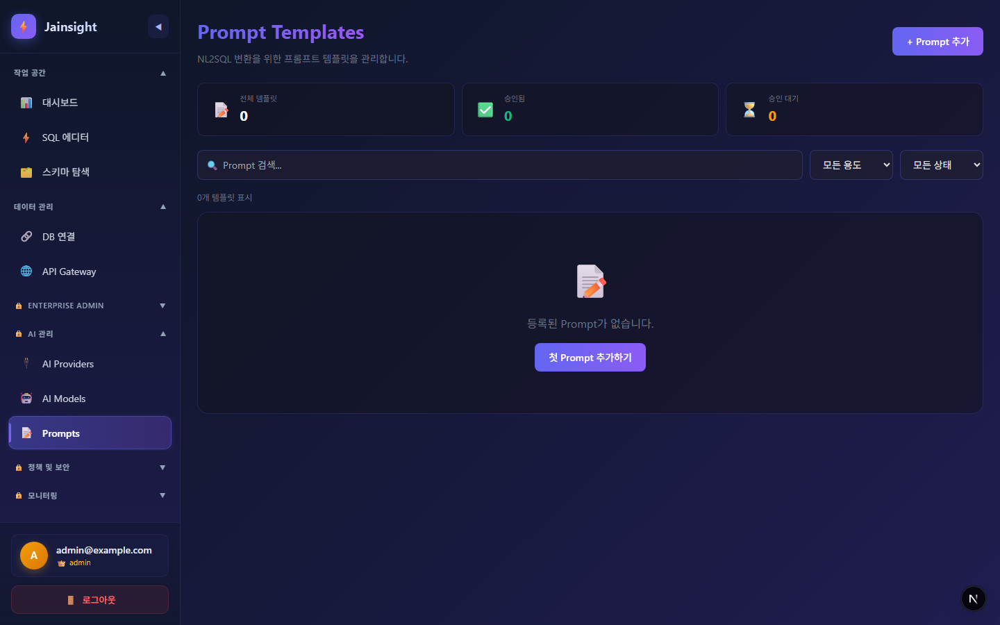
**기능:**

- **템플릿 수정**: 시스템 프롬프트를 수정하여 AI의 페르소나나 응답 형식을 변경합니다.
- **버전 관리**: 프롬프트 변경 이력을 관리하고 이전 버전으로 롤백합니다.

---

## 7. 보안 관리

SQL 및 프롬프트 인젝션 방어, PII 보호 정책을 수립합니다.

### 7.1 NL2SQL 보안 정책

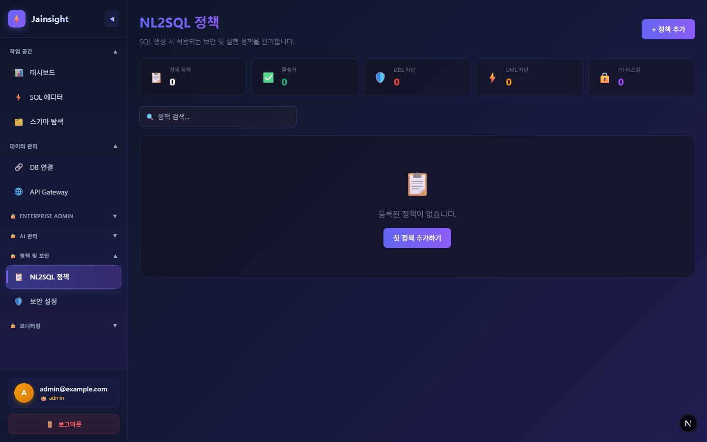
**기능:**

- **DDL/DML 차단**: AI가 데이터베이스 스키마를 변경하거나 데이터를 삭제하는 SQL을 생성하지 못하도록 차단합니다.
- **PII 마스킹**: 주민번호, 전화번호 등 민감 정보가 포함된 컬럼 조회 시 자동으로 마스킹 처리합니다.

---

## 8. 모니터링

AI 서비스의 사용량과 성능을 실시간으로 추적합니다.

### 8.1 AI 대시보드

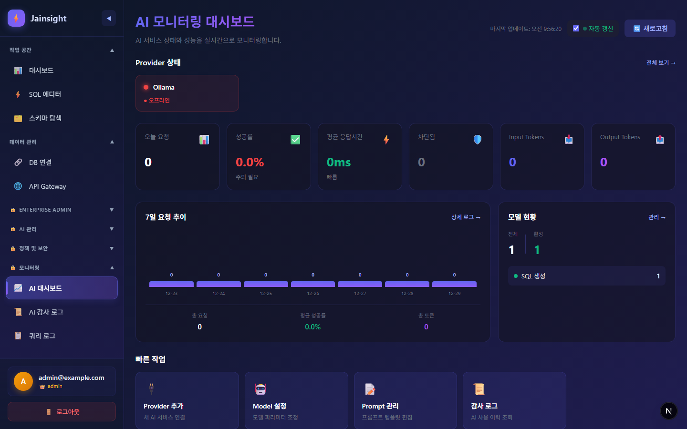
**설명:**

- **토큰 사용량**: 일별/월별 입력 및 출력 토큰 소비량을 확인하여 비용을 관리합니다.
- **성공률/지연시간**: AI 모델의 응답 성공률과 평균 응답 시간을 모니터링합니다.

### 8.2 감사 로그

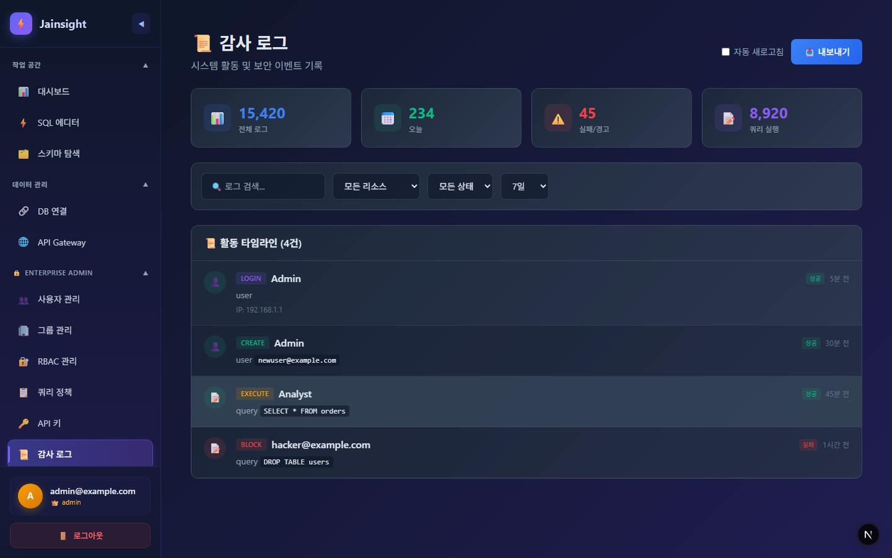
**기능:**

- **로그 조회**: 누가, 언제, 어떤 질문을 통해 어떤 SQL을 생성했는지 상세 내역을 추적합니다.
- **필터링**: 실패한 요청, 차단된 요청만 별도로 필터링하여 보안 위협을 분석합니다.
